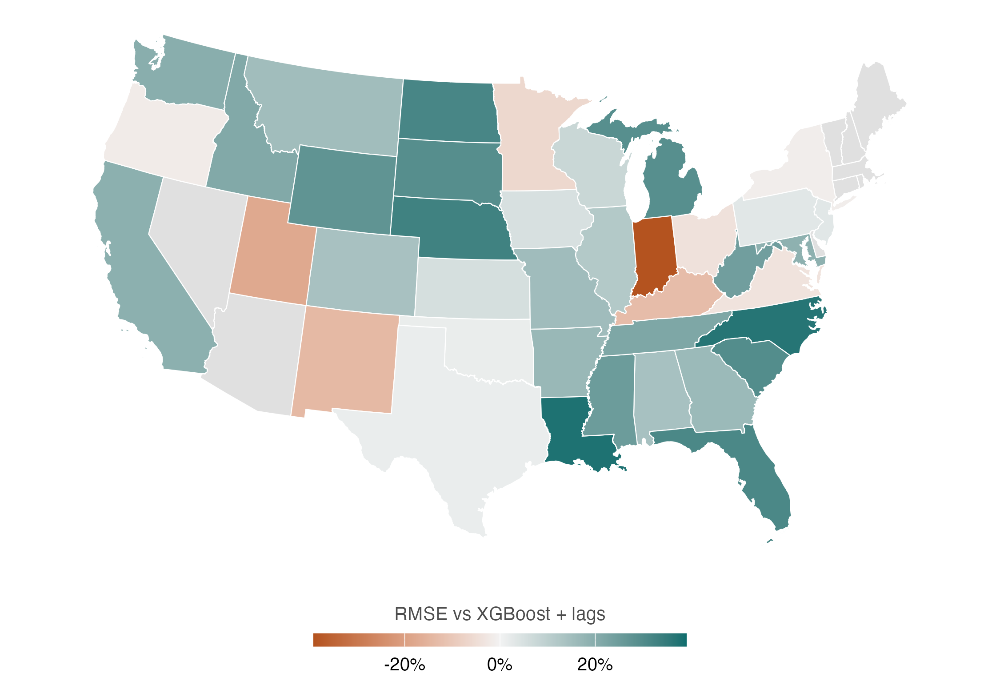
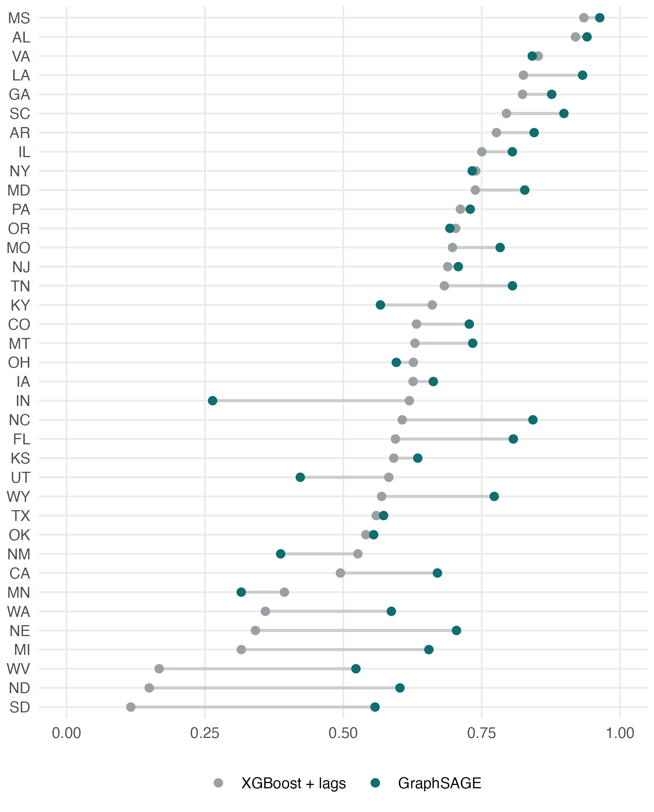
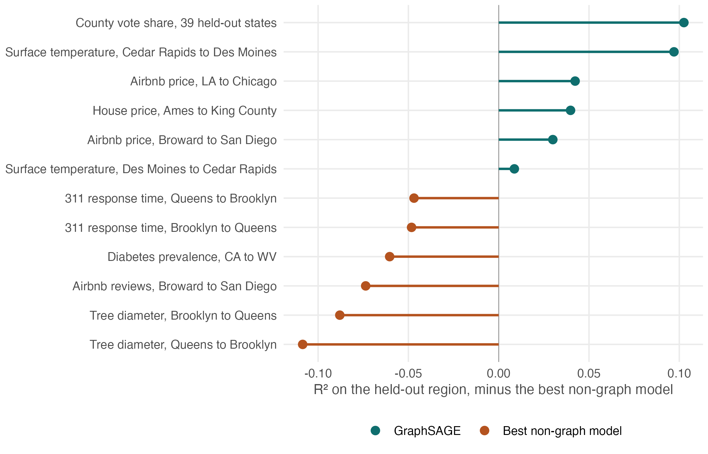
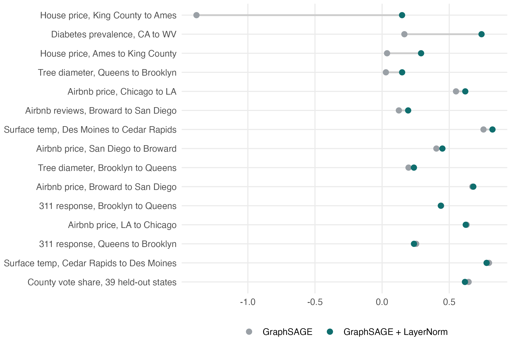

```{r}
#| include: false
library(dplyr)
library(knitr)

folds <- nanoparquet::read_parquet("../data/results/folds.parquet")
states <- nanoparquet::read_parquet("../data/results/states.parquet")

arms <- function(d, metric = "rsq_trad") {
  d |>
    filter(!is.na(arm)) |>
    group_by(arm) |>
    summarise(v = mean(.data[[metric]]), .groups = "drop")
}

# Margin of the best GraphSAGE variant over the best model without a graph.
margin_of <- function(d, metric = "rsq_trad") {
  a <- arms(d, metric)
  g <- grepl("GraphSAGE", a$arm)
  max(a$v[g]) - max(a$v[!g])
}

transfers <- c(
  "heat" = "Surface temperature, Des Moines to Cedar Rapids",
  "heat-rev" = "Surface temperature, Cedar Rapids to Des Moines",
  "chi-la" = "Airbnb price, Chicago to LA",
  "la-chi-rev" = "Airbnb price, LA to Chicago",
  "brow-sd-final" = "Airbnb price, Broward to San Diego",
  "sd-brow-rev" = "Airbnb price, San Diego to Broward",
  "ames-kc-rev" = "House price, Ames to King County",
  "ca-wv-final" = "Diabetes prevalence, CA to WV",
  "nyc311" = "311 response time, Queens to Brooklyn",
  "nyc311-rev" = "311 response time, Brooklyn to Queens",
  "reviews" = "Airbnb reviews, Broward to San Diego",
  "trees" = "Tree diameter, Queens to Brooklyn",
  "trees-rev" = "Tree diameter, Brooklyn to Queens"
)
```

# Design

- Train on one region, predict a second region the model has never seen.
- The two regions carry separate graphs. No edge crosses the boundary.
- Inductive: the test graph did not exist at training time.
- Metric is $R^2 = 1 - \mathrm{SSE}/\mathrm{SST}$ on the held-out region. AUC for classification.
- Arms: OLS, spatial error model (GMM), XGBoost, XGBoost with row-standardised spatial lags of every covariate, GraphSAGE, GraphSAGE with node-level layer normalisation.
- Stochastic arms run 10 to 15 seeds; deterministic arms run once.

# Held-out US states

3,005 counties in the 39 states holding at least 20 counties. Target is county two-party Democratic vote share from 14 demographic and economic covariates. Hold out one state, train on the other 38, predict every county in the held-out state.

```{r}
states |>
  group_by(Model = arm) |>
  summarise(
    `R2` = mean(rsq_trad),
    RMSE = mean(rmse),
    MAE = mean(mae),
    .groups = "drop"
  ) |>
  arrange(-`R2`) |>
  kable(digits = 3, caption = "Mean over the 39 held-out states.")
```

```{r}
g <- states |> filter(arm == "GraphSAGE")
x <- states |> filter(arm == "XGBoost + lags")
j <- inner_join(
  g |> select(STUSPS, n, g_rsq = rsq_trad, g_rmse = rmse, g_mae = mae),
  x |> select(STUSPS, x_rsq = rsq_trad, x_rmse = rmse, x_mae = mae),
  by = "STUSPS"
)
tt <- t.test(j$g_rsq, j$x_rsq, paired = TRUE)
pct <- function(a, b) 100 * (b - a) / b
data.frame(
  Comparison = "GraphSAGE less XGBoost + lags",
  `R2 difference` = mean(j$g_rsq - j$x_rsq),
  `p value` = tt$p.value,
  `States lower error` = sprintf("%d/%d", sum(j$g_rsq > j$x_rsq), nrow(j)),
  `RMSE pct` = mean(pct(j$g_rmse, j$x_rmse)),
  `MAE pct` = mean(pct(j$g_mae, j$x_mae)),
  check.names = FALSE
) |>
  kable(digits = 3, caption = "Paired over states. Percentages are means of per-state change.")
```

```{r}
#| fig-cap: "Per-state change in RMSE, GraphSAGE against XGBoost with spatial lags. Grey states hold fewer than 20 counties and were not tested."

```

```{r}
#| fig-cap: "R-squared on each held-out state, ordered by the XGBoost result. Wisconsin and Idaho are below zero for both models and are omitted from the axis."

```

# Cross-region transfers

Margin is the best GraphSAGE variant less the best arm that uses no graph, both on the held-out region.

```{r}
tab <- lapply(names(transfers), function(r) {
  d <- folds[folds$run == r, ]
  a <- arms(d)
  gi <- grepl("GraphSAGE", a$arm)
  data.frame(
    Transfer = unname(transfers[r]),
    GraphSAGE = max(a$v[gi]),
    `Best other` = max(a$v[!gi]),
    Arm = a$arm[!gi][which.max(a$v[!gi])],
    Margin = max(a$v[gi]) - max(a$v[!gi]),
    check.names = FALSE
  )
}) |> bind_rows()

states_row <- data.frame(
  Transfer = "County vote share, 39 held-out states",
  GraphSAGE = max(arms(states)$v[grepl("GraphSAGE", arms(states)$arm)]),
  `Best other` = max(arms(states)$v[!grepl("GraphSAGE", arms(states)$arm)]),
  Arm = "XGBoost + lags",
  Margin = margin_of(states),
  check.names = FALSE
)

bind_rows(states_row, tab) |>
  arrange(-Margin) |>
  kable(digits = 3, caption = "Ordered by margin.")
```

```{r}
#| fig-cap: "Margin over the best arm without a graph. Land cover is scored by AUC and is excluded from this axis."

```

## Classification

Same two cities and the same predictors as the surface temperature transfer, with land cover class as the target.

```{r}
folds |>
  filter(run == "lulc") |>
  arms("auc") |>
  arrange(-v) |>
  rename(Model = arm, AUC = v) |>
  kable(digits = 4, caption = "Des Moines to Cedar Rapids, land cover class.")
```

Land cover is more spatially autocorrelated than surface temperature. GraphSAGE gains 0.097 $R^2$ on temperature and 0.001 AUC on land cover, so autocorrelation of the target does not order the two outcomes.

# Layer normalisation

Node-level layer normalisation against plain GraphSAGE, paired by seed. SD ratio is the median ratio of feature standard deviations between the two regions, computed from covariates only.

```{r}
ln <- nanoparquet::read_parquet("../data/results/layernorm.parquet")
ln_names <- c(
  "kc-ames" = "House price, King County to Ames",
  "ames-kc-rev" = "House price, Ames to King County",
  "ca-wv-final" = "Diabetes prevalence, CA to WV",
  "chi-la" = "Airbnb price, Chicago to LA",
  "la-chi-rev" = "Airbnb price, LA to Chicago",
  "brow-sd-final" = "Airbnb price, Broward to San Diego",
  "sd-brow-rev" = "Airbnb price, San Diego to Broward",
  "reviews" = "Airbnb reviews, Broward to San Diego",
  "trees" = "Tree diameter, Queens to Brooklyn",
  "trees-rev" = "Tree diameter, Brooklyn to Queens",
  "nyc311" = "311 response time, Queens to Brooklyn",
  "nyc311-rev" = "311 response time, Brooklyn to Queens",
  "heat" = "Surface temperature, Des Moines to Cedar Rapids",
  "heat-rev" = "Surface temperature, Cedar Rapids to Des Moines"
)
lnt <- ln |>
  filter(run %in% names(ln_names)) |>
  transmute(
    Transfer = unname(ln_names[run]),
    GraphSAGE = plain,
    `With LayerNorm` = ln,
    Difference = ln - plain,
    `SD ratio` = sd_ratio
  ) |>
  bind_rows(data.frame(
    Transfer = "County vote share, 39 held-out states",
    GraphSAGE = mean(states$rsq_trad[states$arm == "GraphSAGE"]),
    `With LayerNorm` = mean(states$rsq_trad[states$arm == "GraphSAGE + LayerNorm"]),
    Difference = mean(states$rsq_trad[states$arm == "GraphSAGE + LayerNorm"]) -
      mean(states$rsq_trad[states$arm == "GraphSAGE"]),
    `SD ratio` = NA_real_,
    check.names = FALSE
  )) |>
  arrange(-Difference)
kable(lnt, digits = 3, caption = "Ordered by difference.")
```

```{r}
#| fig-cap: "R-squared on the held-out region for both GraphSAGE variants."

```

```{r}
z <- lnt |> filter(!is.na(`SD ratio`))
z |>
  mutate(Group = ifelse(`SD ratio` >= 1.2, "SD ratio at or above 1.20", "SD ratio below 1.20")) |>
  group_by(Group) |>
  summarise(
    n = n(),
    `Difference above zero` = sum(Difference > 0),
    Median = median(Difference),
    Min = min(Difference),
    Max = max(Difference),
    .groups = "drop"
  ) |>
  kable(digits = 3, caption = "Split at 1.20. The cut is fitted to these transfers and is not validated out of sample.")
```

```{r}
cat(sprintf(
  "Correlation of the difference with the SD ratio: %.2f Pearson, %.2f Spearman (n = %d).",
  cor(z$Difference, z$`SD ratio`),
  cor(z$Difference, z$`SD ratio`, method = "spearman"),
  nrow(z)
))
```

The three largest differences occur where plain GraphSAGE returns a negative or near-zero $R^2$. The SD ratio is computable from covariates before any target label is observed.

# Findings

- GraphSAGE leads on 6 of 13 regression transfers and on the 39-state holdout. It trails on 6 and ties on the classification.
- The transfers it leads are surface temperature, vote share, and property price. The transfers it trails are tree diameter, 311 response time, review counts, and diabetes prevalence.
- Target autocorrelation does not order the outcomes. Land cover is more autocorrelated than surface temperature and shows the smaller margin.
- Direction is not symmetric. Broward to San Diego is +0.030 and San Diego to Broward is `r sprintf("%+.3f", margin_of(folds[folds$run == "sd-brow-rev", ]))`. Both surface temperature directions favour GraphSAGE; the margins differ by a factor of ten.
- Layer normalisation changes $R^2$ by at most 0.027 in either direction on 11 of 15 transfers. On the 4 with an SD ratio at or above 1.20 it raises $R^2$ by 0.12 to 1.53.

# Not established

- Whether a transfer will succeed cannot be determined from the source region alone. Three pre-fit screens were tested against ten transfers with known outcomes; the wins and the losses overlap on all three.
- The held-out state results use one seed per state. A five-seed replication over all 39 states places GraphSAGE between 0.620 and 0.629; the other arms were fit once each.
- Neighbourhood size selected on held-out source data transfers poorly. Bandwidth is an absolute distance and the regions differ in point density. Selection by neighbour count is untested.
- The King County to Ames result reported previously at $R^2$ 0.501 against 0.283 cannot be reproduced from `data/results/folds.parquet`: the 0.501 run carries no arm labels and no baseline at 0.283 appears in the data. It is excluded here.
